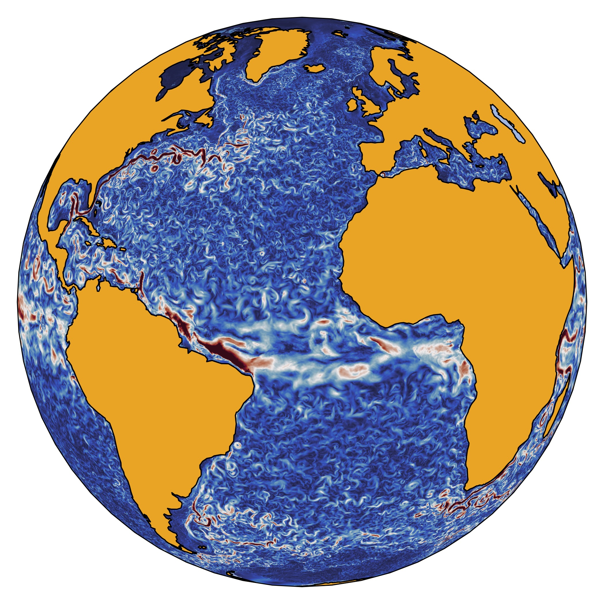

# Visualizing Geospatial Data

Creating visually stunning geospatial data plots using the Matplotlib, Xarray, seaborn, Geopandas, and Cartopy packages 

This image shows an instance of upper ocean circulation, based on data from the GLORYS12, which is a global eddy-resolving physical ocean and sea ice reanalysis at 1/12° horizontal resolution covering the 1993-present altimetry period. GLORYS12 was designed and implemented within the framework of the Copernicus Marine Environment Monitoring Service [CMEMS]([https://link-url-here.org](https://marine.copernicus.eu/)https://marine.copernicus.eu/)
